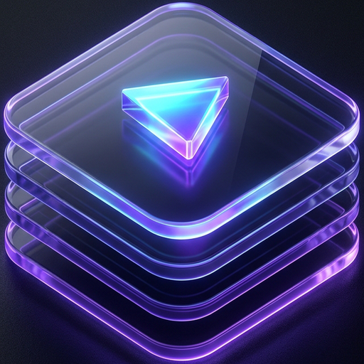

<p align="center">
  
</p>

<h1 align="center">QR8 (Curate)</h1>

<p align="center">
  <strong>Distraction-Free, Self-Hosted Video Curator for Focused Routines & Practices</strong>
</p>

QR8 (pronounced **"Curate"**) is a lightweight, self-hostable web application designed for people who use YouTube videos for physical routines, skills development, and daily practices (e.g. Yoga, Mobility, Calisthenics, Cooking Techniques) without being derailed by algorithmic rabbit holes, recommended feeds, or comment sections.

QR8 acts strictly as a **curated link lens**. It never downloads or hosts media files, running on a single container with a local SQLite database.

---

## Key Features

- 🧘 **Workspaces ("Interests / Domains"):** Create isolated collections (e.g., "Yoga & Mobility", "Strength", "Culinary") with custom emoji icons.
- 🎲 **Daily Shuffle ("Pick for Today"):** Generates 3–5 randomized items from the active workspace library with an instant "Reroll" action to combat choice fatigue.
- 📡 **Key-Free Creator RSS Feeds:** Ingest and subscribe to YouTube creators using public Atom feeds (`https://www.youtube.com/feeds/videos.xml?channel_id=...`) with no Google Cloud API keys.
- ⚡ **Zero-Token Metadata Resolution:** Paste any YouTube video link (`watch?v=`, `youtu.be/`, `/shorts/`) or `@creator` handle; metadata and thumbnails are resolved using the public YouTube oEmbed endpoint.
- 🎬 **Dedicated Distraction-Free Player:** Official YouTube IFrame player configured with `modestbranding=1`, `rel=0` (no random algorithmic recommendations), and `iv_load_policy=3`.
- 📈 **Practice & Completion Tracking:** Automatically listens to player state to track `last_played_at` and increment `completion_count` upon finishing a routine.
- 📝 **Routine Cues & Notes Drawer:** Save form reminders, cues, and breathing notes tied directly to individual routines.
- 🐳 **Single Container Deployment:** Packaged with `better-sqlite3` in WAL mode and volume mounting (`./data:/data`) for zero-maintenance self-hosting.

---

## Quick Start (Docker)

Run with Docker Compose:

```bash
docker compose up -d --build
```

Access the web interface at **`http://<ip_address>:3000/qr8`** (or **`http://localhost:3000/qr8`**; hitting root `/` also automatically redirects to `/qr8`). All SQLite data is persisted locally in `./data/qr8.db`.

---

## Local Development Setup

### Prerequisites

- Node.js 20+ (Node 22 or 24 recommended)
- npm or pnpm

### Installation

```bash
# Clone the repository
git clone https://github.com/mosswild/qr8.git
cd qr8

# Install dependencies
npm install

# Run the local development server
npm run dev
```

Open [http://localhost:3000/qr8](http://localhost:3000/qr8) in your browser. The default sample workspaces ("Yoga & Mobility", "Strength & Calisthenics", "Culinary Techniques") are automatically seeded on initial launch.

### Verification Suite

Run the automated test suite for URL parsing and RSS Atom XML decoding:

```bash
npm test
```

To test a production standalone build:

```bash
npm run build
npm start
```

---

## Architecture

```
qr8/
├── Dockerfile                  # Multi-stage lightweight Alpine build
├── docker-compose.yml          # Standalone service with ./data persistence
├── test-runner.js              # Unit tests for URL and RSS parsing
├── data/                       # Volume mount directory for qr8.db
├── src/
│   ├── app/
│   │   ├── page.tsx            # Top-Level Hub (Workspaces)
│   │   ├── w/[domainId]/
│   │   │   ├── page.tsx        # Curated Deck Dashboard (Horizontal shelves)
│   │   │   └── player/
│   │   │       └── page.tsx    # Distraction-Free Player Mode
│   │   └── api/
│   │       ├── ingest/route.ts # oEmbed and channel resolver
│   │       ├── rss/sync/route.ts# RSS feed synchronization
│   │       ├── domains/route.ts# Workspace CRUD
│   │       ├── videos/route.ts # Video mutations & completion tracking
│   │       └── playlists/route.ts # Curated sub-groupings
│   ├── lib/
│   │   ├── db/
│   │   │   ├── index.ts        # better-sqlite3 singleton with WAL mode
│   │   │   └── schema.sql      # Database DDL
│   │   ├── youtube/
│   │   │   ├── parser.ts       # URL extractor (watch, shorts, youtu.be, handles)
│   │   │   ├── oembed.ts       # Public oEmbed metadata resolver
│   │   │   └── rss.ts          # Atom XML feed parser & creator sync
│   │   └── cron/
│   │       └── scheduler.ts    # 6-hour interval polling worker
│   └── components/
│       ├── dashboard/          # Horizontal Shelves (DailyShuffle, VideoCard, etc.)
│       ├── hub/                # Workspace Cards & Modal
│       └── player/             # YouTube IFrame API & Notes Drawer
```

---

## Environment Variables

| Variable | Default | Description |
| :--- | :--- | :--- |
| `PORT` | `3000` | HTTP port to listen on |
| `DB_PATH` | `/data/qr8.db` | File path to persistent SQLite database |
| `RSS_POLL_INTERVAL_HOURS` | `6` | Hours between automatic channel RSS polling |
| `NODE_ENV` | `production` | Environment mode |

---

## Roadmap

- 🎯 **Ultra-Minimal Opening Portal:**
  - Remove the top hero banner block (*"Curated Video Hubs without Algorithmic Clutter"*) so the home portal focuses directly on workspace cards.
- 🧼 **Header Decluttering:**
  - Remove the *"Zero Algorithm Drift"* badge from the header navigation bar for a cleaner, distraction-free aesthetic.
- 📑 **YouTube Playlist Ingestion:**
  - Support pasting full YouTube playlist URLs (`playlist?list=PL...`) into Quick Add to batch-ingest all videos and automatically generate a corresponding workspace playlist in the app.
- 🗂️ **Unified Playlists Shelf & Stacked Player Deck:**
  - Consolidate playlists into a single horizontal shelf where each playlist appears as a visually "stacked" video card deck.
  - When opened, load the player with a dedicated right-hand queue sidebar to play videos sequentially or jump directly to any queued routine.
- 📥 **Creator Subscriptions Isolation & Selective Curation:**
  - Prevent raw channel subscriptions from auto-flooding the permanent "Workspace Library" or "Daily Shuffle"; subscribed uploads will only appear in the "What's New" inbox carousel until the user explicitly chooses to add them to their curated library.
- 🎨 **Logo & Brand Typography Correction:**
  - Update the square icon badge in the header from "Q8" to "QR8" to properly reflect the app name.
- 📺 **Smart TV & Apple TV Streaming:**
  - Dedicated AirPlay and Google Cast / Chromecast triggers integrated directly into player controls.
  - "Companion / Remote Display" mode to control workout playback and view cues from a mobile device while displaying full-screen on a television.
- 🖼️ **Dynamic Workspace Thumbnails & Blended Cards:**
  - Replace static emoji icons on workspace cards with blended thumbnails pulled dynamically from a random video within each workspace.
- 🎴 **Workspace Card Action Streamlining:**
  - Remove redundant "Enter Workspace" text from workspace cards, making the entire card a clean, direct click target.
- 🏷️ **Nomenclature & Terminology Standardization:**
  - Standardize consistently on "Workspaces" across all UI copy, portal screens, and documentation to resolve inconsistent use of "domains".
- 📑 **Workspace Shelf Layout Reordering:**
  - Position curated Playlists prominently above the "What's New" carousel within each workspace dashboard.

---

## License

MIT License.
