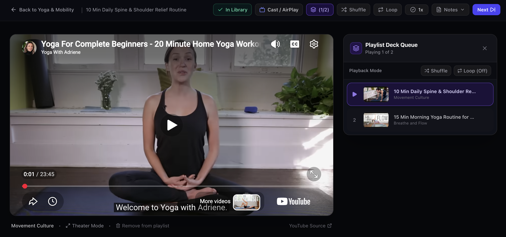
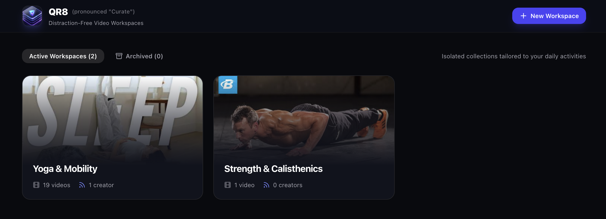
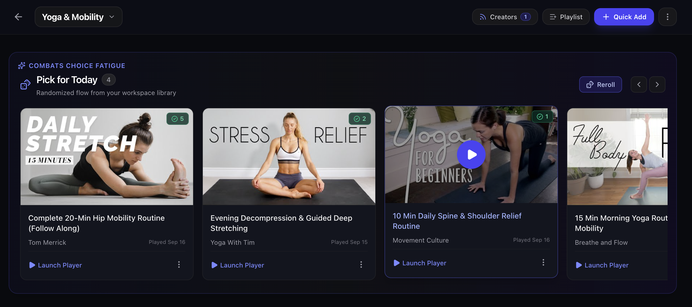
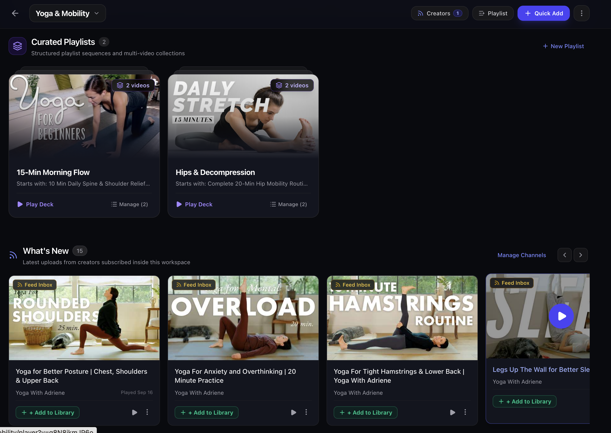

<p align="center">
  
</p>

<h1 align="center">QR8 (Curate)</h1>

<p align="center">
  <strong>Distraction-Free, Self-Hosted Video Curator for Focused Workspaces & Practice</strong>
</p>

QR8 (pronounced **"Curate"**) is a lightweight, self-hostable web application designed for people who use YouTube videos for physical routines, skills development, and daily practices (e.g. Yoga, Mobility, Calisthenics, Music, Cooking Techniques) without being derailed by algorithmic rabbit holes, recommended feeds, or comment sections.

QR8 acts strictly as a **curated link lens**. It never downloads or hosts media files, running on a single container with a local SQLite database.

<p align="center">
  
</p>

---

## Key Features

### 🗂️ Workspaces Portal
Create isolated workspaces (e.g., "Yoga & Mobility", "Strength & Calisthenics", "Culinary Arts") to keep separate disciplines completely partitioned. Cards feature dynamic blended video thumbnails, live video and creator counts, and quick management actions (Rename, Archive, Delete).

<p align="center">
  
</p>

- **Isolated Collections:** Partition your practices without cross-topic clutter.
- **Dynamic Card Art:** Automatically selects video thumbnails from each workspace for a sleek, modern visual aesthetic.
- **Workspace Archiving:** Temporarily stash workspaces in the Archive tab to declutter your active hub without deleting saved videos or subscriptions.
- **Quick Switcher:** Switch between workspaces from any page with a single click.

---

### 🎲 "Pick for Today" (Combats Choice Fatigue)
Eliminate decision paralysis when starting a session. QR8 picks a randomized selection from your curated workspace library with a single click.

<p align="center">
  
</p>

- **Instant Reroll:** Shuffle another set of videos in milliseconds.
- **Play & Completion Counters:** Quickly see how many times you've completed a video and when it was last played.
- **Quick Player Launch:** Launch directly into distraction-free player mode from any card.

---

### 📑 Curated Playlists & Creator Inboxes
Organize multi-part courses, progressive routines, or favorite collections into structured decks. Subscribe directly to creators with zero Google API keys.

<p align="center">
  
</p>

- **Stacked Playlist Decks:** Visual stacked card decks showing total queued videos and starting routines.
- **Key-Free Creator RSS Feeds:** Ingest and track YouTube channels via public Atom feeds (`/feeds/videos.xml?channel_id=...`).
- **Selective Curation Inbox:** Subscribed uploads land safely in your "What's New" feed inbox until you choose to curate them into your permanent library.
- **Zero-Token Metadata Resolution:** Paste any YouTube video link (`watch?v=`, `youtu.be/`, `/shorts/`) or `@creator` handle; metadata and thumbnails resolve instantly via public oEmbed.

---

### 🎬 Distraction-Free Cinema Player & Queue
An uncluttered, focused playback stage powered by YouTube's official player with algorithmic recommendations (`rel=0`), annotations, and branding stripped away.

<p align="center">
  
</p>

- **Interactive Queue Sidebar:** Track upcoming videos in the playlist, jump directly to any queued video, or reorder sequences.
- **Shuffle & Loop Controls:** Built-in playlist shuffle and multi-mode loop toggles (Loop Playlist, Loop Single Video, Loop Off).
- **Smart TV & AirPlay Support:** Native casting prompts to stream sessions to Apple TV, Chromecast, or Smart TVs.
- **Personal Notes & Timestamp Cues:** Save form reminders, breathing cues, and adjustments stored per routine.
- **Automatic Completion Tracking:** Records session timestamps and increments completion counters automatically when videos finish.

---

## Quick Start (Docker)

Run with Docker Compose:

```bash
docker compose up -d --build
```

Access the web interface at **`http://<ip_address>:3000/qr8`** (or **`http://localhost:3000/qr8`**; hitting root `/` also automatically redirects to `/qr8`). All SQLite data is persisted locally in `./data/qr8.db`.

---

## Local Development Setup

### Prerequisites

- Node.js 20+ (Node 22 or 24 recommended)
- npm or pnpm

### Installation

```bash
# Clone the repository
git clone https://github.com/mosswild/qr8.git
cd qr8

# Install dependencies
npm install

# Run the local development server
npm run dev
```

Open [http://localhost:3000/qr8](http://localhost:3000/qr8) in your browser. The default sample workspaces ("Yoga & Mobility", "Strength & Calisthenics", "Culinary Techniques") are automatically seeded on initial launch.

### Verification Suite

Run the automated test suite for URL parsing and RSS Atom XML decoding:

```bash
npm test
```

To test a production standalone build:

```bash
npm run build
npm start
```

---

## Architecture

```
qr8/
├── Dockerfile                  # Multi-stage lightweight Alpine build
├── docker-compose.yml          # Standalone service with ./data persistence
├── test-runner.js              # Unit tests for URL and RSS parsing
├── data/                       # Volume mount directory for qr8.db
├── docs/
│   └── images/                 # Screenshot assets
├── src/
│   ├── app/
│   │   ├── page.tsx            # Top-Level Hub (Workspaces)
│   │   ├── w/[domainId]/
│   │   │   ├── page.tsx        # Curated Deck Dashboard (Horizontal shelves)
│   │   │   └── player/
│   │   │       └── page.tsx    # Distraction-Free Player Mode
│   │   └── api/
│   │       ├── ingest/route.ts # oEmbed and channel resolver
│   │       ├── rss/sync/route.ts# RSS feed synchronization
│   │       ├── domains/route.ts# Workspace CRUD & archive
│   │       ├── videos/route.ts # Video mutations & completion tracking
│   │       └── playlists/route.ts # Curated sub-groupings
│   ├── lib/
│   │   ├── db/
│   │   │   ├── index.ts        # better-sqlite3 singleton with WAL mode
│   │   │   └── schema.sql      # Database DDL
│   │   ├── youtube/
│   │   │   ├── parser.ts       # URL extractor (watch, shorts, youtu.be, handles)
│   │   │   ├── oembed.ts       # Public oEmbed metadata resolver
│   │   │   └── rss.ts          # Atom XML feed parser & creator sync
│   │   └── cron/
│   │       └── scheduler.ts    # 6-hour interval polling worker
│   └── components/
│       ├── dashboard/          # Horizontal Shelves (DailyShuffle, VideoCard, etc.)
│       ├── hub/                # Workspace Cards & Modal
│       └── player/             # YouTube IFrame API & Notes Drawer
```

---

## Environment Variables

| Variable | Default | Description |
| :--- | :--- | :--- |
| `PORT` | `3000` | HTTP port to listen on |
| `DB_PATH` | `/data/qr8.db` | File path to persistent SQLite database |
| `RSS_POLL_INTERVAL_HOURS` | `6` | Hours between automatic channel RSS polling |
| `NODE_ENV` | `production` | Environment mode |

---

## Roadmap

- 📑 **YouTube Playlist Ingestion:**
  - Support pasting full YouTube playlist URLs (`playlist?list=PL...`) into Quick Add to batch-ingest all videos and automatically generate a corresponding workspace playlist in the app.
- 📱 **Companion / Remote Display Mode:**
  - Control workout playback and view cues from a mobile device while displaying full-screen on a television or external monitor.
- 🏷️ **Tagging & Duration Filtering:**
  - Filter curated library items by duration (e.g. `< 15 min`, `15–30 min`, `30+ min`) or user-defined activity tags.

---

## License

MIT License.
